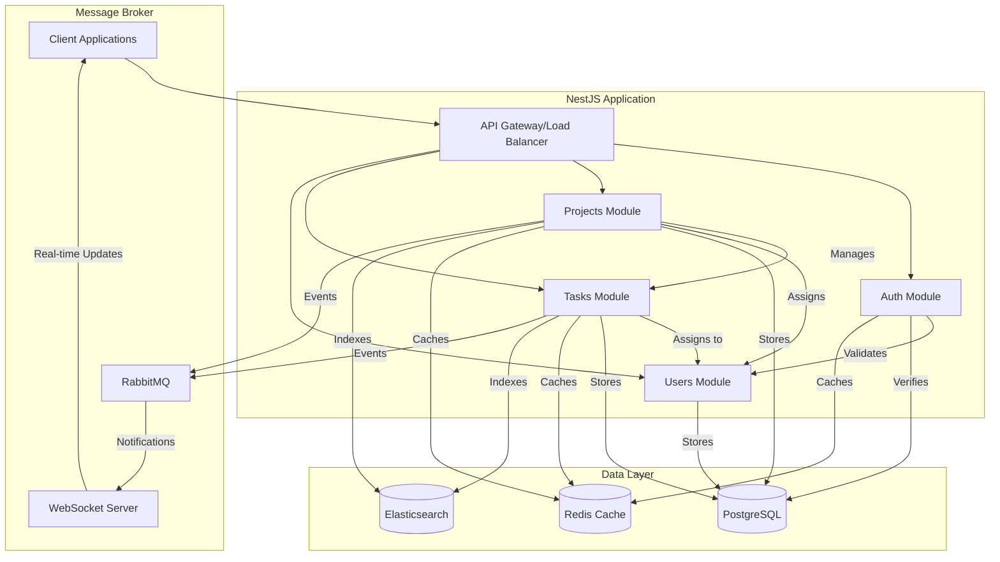

# Project Management System

A robust and scalable project management system built with NestJS, TypeScript, and modern web technologies. This system provides comprehensive project and task management capabilities with role-based access control, real-time updates, and advanced features for team collaboration.

## Project Overview

This enterprise-grade project management system is designed to help teams organize, track, and manage projects efficiently. It features a modular architecture, secure authentication, and comprehensive API support for both REST and GraphQL.

### Key Features

- 🔐 **Authentication & Authorization**
  - JWT-based authentication
  - Role-based access control (Admin, Manager, Member, Viewer)
  - Secure password hashing with bcrypt

- 📊 **Project Management**
  - Create and manage multiple projects
  - Assign project owners and team members
  - Track project status, budget, and timelines
  - Project metadata and tagging support

- ✅ **Task Management**
  - Hierarchical task organization
  - Task dependencies management
  - Priority and status tracking
  - Time tracking (estimated vs. actual hours)
  - Task assignments and labels

- 🚀 **Advanced Features**
  - Real-time updates via WebSocket
  - Full-text search with Elasticsearch
  - Redis caching for improved performance
  - Message queuing with RabbitMQ
  - GraphQL API support
  - Comprehensive REST API with Swagger documentation

## Architecture Overview

### System Architecture Diagram



### Project Structure
```
project-manage/
├── src/
│   ├── common/              # Shared code, base entities, utilities
│   ├── config/             # Configuration files
│   ├── modules/            # Feature modules
│   │   ├── auth/          # Authentication & authorization
│   │   ├── users/         # User management
│   │   ├── projects/      # Project management
│   │   └── tasks/         # Task management
│   └── main.ts            # Application entry point
```

## Features

- User Authentication & Authorization (JWT)
- Role-Based Access Control (Admin, Manager, Member, Viewer)
- Project Management
- Task Management with Dependencies
- Real-time Updates (WebSockets)
- Full-text Search (Elasticsearch)
- Caching (Redis)
- GraphQL API
- REST API with Swagger Documentation

## Prerequisites

- Node.js (v20+)
- Docker and Docker Compose
- PostgreSQL
- Redis
- Elasticsearch
- RabbitMQ

## Getting Started

1. Clone the repository
2. Install dependencies:

   ```bash
   npm install
   ```

3. Set up environment variables:
   - Copy `.env.example` to `.env`
   - Update the values as needed

4. Start the infrastructure services:

   ```bash
   docker-compose up -d postgres redis elasticsearch rabbitmq
   ```

5. Run database migrations:

   ```bash
   npm run migration:run
   ```

6. Start the application:

   ```bash
   # Development
   npm run start:dev

   # Production
   npm run build
   npm run start:prod
   ```

## API Documentation

- REST API: http://localhost:3000/api
- GraphQL Playground: http://localhost:3000/graphql

## Database Design

### Sharding Strategy

The project uses database sharding for horizontal scaling:

- Projects are sharded by organization ID
- Tasks are co-located with their projects
- User data is globally available across all shards

### Partitioning

- Tasks table is partitioned by creation date for efficient archival
- Audit logs are partitioned monthly
- Analytics data is partitioned by time periods

## Testing

```bash
# Unit tests
npm run test

# E2E tests
npm run test:e2e

# Test coverage
npm run test:cov

# Load testing
npm run test:load
```

## Performance Optimization

1. Caching Strategy:
   - Redis caches frequently accessed data
   - Cache invalidation uses event-based approach
   - Distributed caching for scalability

2. Database Optimization:
   - Proper indexing on frequently queried fields
   - Database connection pooling
   - Query optimization and monitoring

3. Task Scheduling:
   - Bull queue for background jobs
   - Rate limiting on API endpoints
   - Delayed job processing for non-urgent tasks

## Deployment

1. Using Docker:

   ```bash
   docker-compose up -d
   ```

2. Manual Deployment:
   - Set up Node.js environment
   - Configure environment variables
   - Set up process manager (PM2)
   - Configure reverse proxy (Nginx)

## Security Measures

- JWT authentication
- Role-based access control
- Request rate limiting
- Input validation
- SQL injection protection
- XSS protection
- CORS configuration
- Helmet security headers

## Documentation

Generate detailed documentation:

```bash
npm run docs:generate
```

View the documentation at `http://localhost:8080`

## Contributing

1. Fork the repository
2. Create a feature branch
3. Commit your changes
4. Push to the branch
5. Create a Pull Request

## License

This project is licensed under the MIT License - see the LICENSE file for details
[circleci-url]: https://circleci.com/gh/nestjs/nest

  <p align="center">A progressive <a href="http://nodejs.org" target="_blank">Node.js</a> framework for building efficient and scalable server-side applications.</p>
    <p align="center">
<a href="https://www.npmjs.com/~nestjscore" target="_blank"></a>
<a href="https://www.npmjs.com/~nestjscore" target="_blank"></a>
<a href="https://www.npmjs.com/~nestjscore" target="_blank"></a>
<a href="https://circleci.com/gh/nestjs/nest" target="_blank"></a>
<a href="https://discord.gg/G7Qnnhy" target="_blank"></a>
<a href="https://opencollective.com/nest#backer" target="_blank"></a>
<a href="https://opencollective.com/nest#sponsor" target="_blank"></a>
  <a href="https://paypal.me/kamilmysliwiec" target="_blank"></a>
    <a href="https://opencollective.com/nest#sponsor"  target="_blank"></a>
  <a href="https://twitter.com/nestframework" target="_blank"></a>
</p>
  <!--[](https://opencollective.com/nest#backer)
  [](https://opencollective.com/nest#sponsor)-->

## Description

[Nest](https://github.com/nestjs/nest) framework TypeScript starter repository.

## Project setup

```bash
$ npm install
```

## Compile and run the project

```bash
# development
$ npm run start

# watch mode
$ npm run start:dev

# production mode
$ npm run start:prod
```

## Run tests

```bash
# unit tests
$ npm run test

# e2e tests
$ npm run test:e2e

# test coverage
$ npm run test:cov
```

## Deployment

When you're ready to deploy your NestJS application to production, there are some key steps you can take to ensure it runs as efficiently as possible. Check out the [deployment documentation](https://docs.nestjs.com/deployment) for more information.

If you are looking for a cloud-based platform to deploy your NestJS application, check out [Mau](https://mau.nestjs.com), our official platform for deploying NestJS applications on AWS. Mau makes deployment straightforward and fast, requiring just a few simple steps:

```bash
$ npm install -g @nestjs/mau
$ mau deploy
```

With Mau, you can deploy your application in just a few clicks, allowing you to focus on building features rather than managing infrastructure.

## Resources

Check out a few resources that may come in handy when working with NestJS:

- Visit the [NestJS Documentation](https://docs.nestjs.com) to learn more about the framework.
- For questions and support, please visit our [Discord channel](https://discord.gg/G7Qnnhy).
- To dive deeper and get more hands-on experience, check out our official video [courses](https://courses.nestjs.com/).
- Deploy your application to AWS with the help of [NestJS Mau](https://mau.nestjs.com) in just a few clicks.
- Visualize your application graph and interact with the NestJS application in real-time using [NestJS Devtools](https://devtools.nestjs.com).
- Need help with your project (part-time to full-time)? Check out our official [enterprise support](https://enterprise.nestjs.com).
- To stay in the loop and get updates, follow us on [X](https://x.com/nestframework) and [LinkedIn](https://linkedin.com/company/nestjs).
- Looking for a job, or have a job to offer? Check out our official [Jobs board](https://jobs.nestjs.com).

## Support

Nest is an MIT-licensed open source project. It can grow thanks to the sponsors and support by the amazing backers. If you'd like to join them, please [read more here](https://docs.nestjs.com/support).

## Stay in touch

- Author - [Kamil Myśliwiec](https://twitter.com/kammysliwiec)
- Website - [https://nestjs.com](https://nestjs.com/)
- Twitter - [@nestframework](https://twitter.com/nestframework)

## License

Nest is [MIT licensed](https://github.com/nestjs/nest/blob/master/LICENSE).
